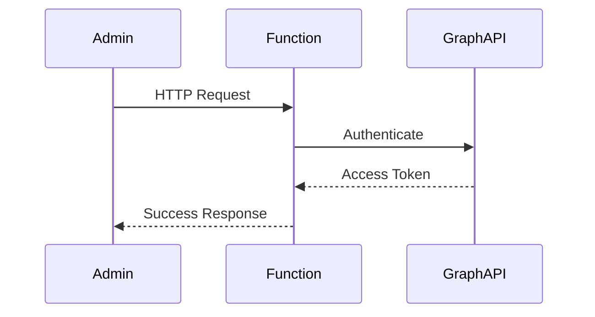

# OnedriveAudit - GitHub Copilot Instructions

## Project Overview

OnedriveAudit is a serverless Azure Functions application that tracks OneDrive folder and file structure changes in real-time. The system monitors create, rename, move, and delete operations using the Microsoft Graph delta API and webhooks, storing all state and history in Azure PostgreSQL.

## Tech Stack

- **Runtime**: Node.js with TypeScript
- **Platform**: Azure Functions (serverless)
- **Database**: Azure PostgreSQL
- **Infrastructure**: Terraform for Infrastructure as Code (IaC)
- **API Integration**: Microsoft Graph API
  - Delta endpoint for incremental sync
  - Webhook subscriptions for real-time notifications

## Project Structure

```
src/
  functions/      # Azure Functions entry points
  services/       # Business logic and service layer
  models/         # TypeScript data models and interfaces
  config/         # Configuration management
  utils/          # Utility functions and helpers

schemas/          # Database schemas
terraform/        # Infrastructure as Code
docs/             # Architecture and design documentation
tests/            # Unit and integration tests
```

## Coding Conventions

### TypeScript

- Use TypeScript for all code; enable strict mode
- Always use type annotations for function parameters and return types
- Use interfaces for data structures and models
- Prefer `const` over `let`; avoid `var`
- Use async/await instead of callbacks or raw promises

### Naming Conventions

- **Files**: Use camelCase for TypeScript files (e.g., `deltaProcessor.ts`)
- **Functions**: Use camelCase (e.g., `processDeltaBatch`)
- **Classes**: Use PascalCase (e.g., `GraphClient`)
- **Interfaces**: Use PascalCase (e.g., `DriveItem`, `ChangeEvent`)
- **Constants**: Use UPPER_SNAKE_CASE (e.g., `MAX_RETRY_ATTEMPTS`)

### Azure Functions

- Each function should be in its own file under `src/functions/`
- Function names should be descriptive and action-oriented
- Use proper Azure Functions TypeScript bindings
- Handle errors gracefully with appropriate logging

### Data Models

The application uses the following core data models:

- **DriveItem**: Represents OneDrive files and folders
- **ChangeEvent**: Records change operations (create, rename, move, delete)
- **DeltaState**: Maintains delta tokens for incremental sync
- **WebhookSubscription**: Tracks active webhook subscriptions

### Database

- Use parameterized queries to prevent SQL injection
- All database operations should be in repository classes
- Repository methods should be async
- Handle connection errors and implement retry logic where appropriate

### Microsoft Graph Integration

- Use the Graph client abstraction for all API calls
- Implement pagination handling for delta queries
- Store and manage delta tokens for efficient syncing
- Handle Graph API errors and throttling appropriately

## Testing Guidelines

### Test Structure

- Place unit tests in `tests/unit/`
- Place integration tests in `tests/integration/`
- Test files should follow the pattern `*.test.ts`

### Test Requirements

- Write unit tests for all business logic
- Test Graph client pagination and delta processing
- Test repository CRUD operations
- Create integration tests with mocked Graph responses for:
  - File/folder creation
  - Renames
  - Moves
  - Deletions
- Validate database state after processing operations
- Target minimum 70% code coverage

### Testing Best Practices

- Use proper mocking for external dependencies (Graph API, database)
- Keep tests focused and independent
- Use descriptive test names that explain what is being tested
- Follow Arrange-Act-Assert pattern

## Error Handling

- Use try-catch blocks for async operations
- Log errors with sufficient context for debugging
- Return meaningful error messages to clients
- Implement proper error recovery where possible

## Documentation

- Add JSDoc comments for public functions and classes
- Keep documentation up to date with code changes
- Reference these key documents:
  - Architecture overview
  - UML sequence diagrams for Function App flow
  - UML class diagrams for data models

### Documentation Standards for Diagrams

When creating or updating documentation with visual diagrams in markdown files:

- **Prefer Mermaid diagrams** for all visual representations in `.md` files
- Use Mermaid syntax for:
  - **Sequence diagrams**: System interactions and workflows
  - **Flowcharts**: Process flows and decision trees
  - **Entity Relationship diagrams**: Database schemas and data models
  - **State diagrams**: Component state transitions
  - **Class diagrams**: Object-oriented design structures
- Mermaid diagrams are rendered natively by GitHub and many markdown viewers
- Keep diagram syntax clean and well-formatted for maintainability
- Add descriptive titles and labels to diagram elements
- Use consistent naming conventions in diagrams that match code entities

Example Mermaid sequence diagram:


For more information on Mermaid syntax, see: https://mermaid.js.org/

## Multi-Agent Architecture

This project is designed to be built by seven cooperating AI agents:

1. **Repo Creation Agent**: Initial setup and structure
2. **Solution Architect Agent**: Overall solution documentation and alignment between agents
3. **Technical Architect Agent**: Technical design and coding standards
4. **Database Agent**: Schema design and implementation
5. **Terraform IaC Agent**: Infrastructure provisioning
6. **Backend Implementation Agent**: Core application logic
7. **QA/Test Agent**: Test suite implementation

When contributing, ensure your work aligns with the agent responsibilities and maintains consistency across the codebase.

## Project Status and Documentation Maintenance

**IMPORTANT**: After completing any task or implementing any significant change, you MUST update the project status documentation to reflect the current state of the project.

### Required Updates After Task Completion

1. **Update PROJECT-STATUS.md**
   - Mark completed tasks with ✅ in the appropriate agent section
   - Update completion percentages for the agent you're working on
   - Move items from "Outstanding Items" to "Completed Items" as appropriate
   - Update the "Overall Completion" percentage at the top of the file
   - Update the "Current State" section to reflect the latest progress
   - Add any new risks or issues discovered during implementation
   - Update the "Last Updated" timestamp at the bottom

2. **Update NEXT-STEPS.md**
   - Mark completed steps with ✅ in the quick status table
   - Update status indicators (🟢 Complete, 🟡 In Progress, ⚪ Not Started)
   - Remove completed immediate next steps
   - Add new immediate next steps based on current progress
   - Update the "Last Updated" timestamp at the top

3. **Update Relevant Agent Files**
   - If working on a specific agent's tasks, update the corresponding agent specification file (e.g., `backend-agent.md`, `database-agent.md`)
   - Mark completed deliverables
   - Document any deviations from the original plan
   - Note any blockers or dependencies discovered

### When to Update Documentation

- ✅ After completing a major milestone or deliverable
- ✅ After finishing work on an entire agent's scope
- ✅ After making significant architectural decisions
- ✅ When discovering new dependencies or blockers
- ✅ At the end of each working session or day
- ✅ Before creating a pull request or committing major changes

### Documentation Update Checklist

Before considering a task complete, verify:
- [ ] PROJECT-STATUS.md reflects the current completion state
- [ ] NEXT-STEPS.md shows accurate immediate next steps
- [ ] Completion percentages are updated
- [ ] Status indicators are current
- [ ] Timestamps are updated
- [ ] Any blockers or risks are documented

### Example: Completing Database Agent Tasks

When the Database Agent completes the schema:
1. Update `PROJECT-STATUS.md`:
   - Change Database Agent from "Not Started - 0%" to "Complete - 100%"
   - Move all database tasks from "Outstanding Items" to "Completed Items"
   - Update overall project completion percentage
2. Update `NEXT-STEPS.md`:
   - Change Database Agent status from ⚪ to 🟢
   - Update the immediate next steps to focus on the next agent
3. Update `database-agent.md`:
   - Mark all deliverables as complete
   - Document the final schema location

This ensures that all team members and agents have an accurate, real-time view of project progress and can coordinate their work effectively.

## Best Practices

- Follow the principle of separation of concerns
- Keep functions small and focused on a single responsibility
- Use dependency injection where appropriate
- Implement proper logging for observability
- Handle edge cases and error scenarios
- Write clean, self-documenting code
- Ensure all commits compile and pass tests
- Update documentation when making architectural changes

## Security

- Never commit secrets or credentials to the repository
- Use environment variables for configuration
- Implement proper authentication for Azure Functions
- Validate all input data
- Use secure connections for database and API calls

## Performance

- Implement efficient delta processing with proper pagination
- Use connection pooling for database operations
- Cache delta tokens appropriately
- Optimize Graph API calls to minimize rate limiting

## Reference Documentation

For detailed information, refer to:
- `docs/architecture.md` - System architecture
- `docs/uml-sequence-function-app.md` - Function flow diagrams
- `docs/uml-class-data-model.md` - Data model diagrams
- `README.md` - Project overview and agent specifications
