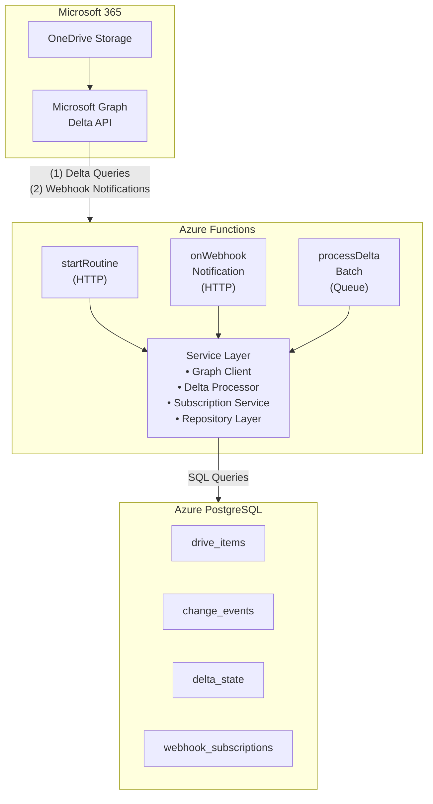
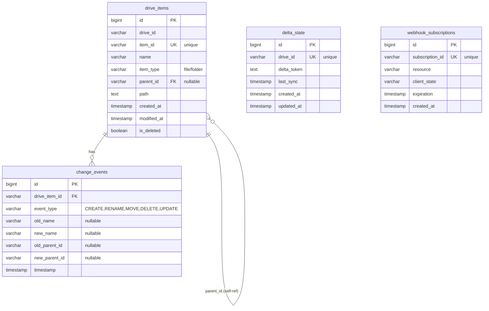

# OnedriveAudit System Architecture

**Version:** 1.0  
**Last Updated:** February 15, 2026  
**Status:** Initial Design

---

## Table of Contents

1. [System Overview](#system-overview)
2. [Technology Stack](#technology-stack)
3. [Architecture Components](#architecture-components)
4. [Data Flow](#data-flow)
5. [Azure Services Integration](#azure-services-integration)
6. [Microsoft Graph Integration](#microsoft-graph-integration)
7. [Data Model](#data-model)
8. [Security & Authentication](#security--authentication)
9. [Error Handling & Resilience](#error-handling--resilience)
10. [Deployment Architecture](#deployment-architecture)
11. [Scalability Considerations](#scalability-considerations)

---

## System Overview

### Purpose

OnedriveAudit is a serverless Azure Functions application designed to track OneDrive folder and file structure changes in real-time. The system provides comprehensive audit logging of all file system operations including:

- **File/Folder Creation** - Track when new items are added
- **Renames** - Detect when items are renamed
- **Moves** - Track when items change parent folders
- **Deletions** - Record when items are removed

### Goals

1. **Real-time Monitoring** - Leverage Microsoft Graph webhooks for near-instantaneous change notifications
2. **Complete History** - Store all change events with full audit trail
3. **Efficient Sync** - Use delta tokens for incremental synchronization
4. **Scalability** - Serverless architecture to handle variable loads
5. **Reliability** - Robust error handling and retry mechanisms

### Key Features

- **Delta API Integration** - Efficient incremental synchronization using Microsoft Graph delta queries
- **Webhook Notifications** - Real-time change notifications for immediate processing
- **Persistent State** - All current state and history stored in PostgreSQL
- **Soft Deletes** - Deleted items remain in database with `is_deleted` flag
- **Change Detection** - Intelligent detection of rename vs move vs create operations
- **Path Tracking** - Full hierarchical path maintained for each item

---

## Technology Stack

### Runtime & Language

| Component | Technology | Version |
|-----------|-----------|---------|
| Runtime | Node.js | 18.x |
| Language | TypeScript | 5.9+ |
| Type Safety | Strict Mode | Enabled |

### Azure Services

| Service | Purpose | Tier |
|---------|---------|------|
| Azure Functions | Serverless compute | Consumption Plan |
| Azure PostgreSQL | State & history storage | Flexible Server |
| Azure Storage | Function app storage | Standard |
| Azure Monitor | Logging & diagnostics | Standard |

### Key Dependencies

```json
{
  "@azure/functions": "^4.x",
  "@microsoft/microsoft-graph-client": "^3.0.7",
  "@azure/identity": "^4.13.0",
  "pg": "^8.18.0"
}
```

### Development Tools

- **Build:** TypeScript Compiler
- **Testing:** Jest 30.2.0 with ts-jest
- **Linting:** ESLint 9.39
- **IaC:** Terraform

---

## Architecture Components

### High-Level Component Diagram



### Component Descriptions

#### Azure Functions

1. **startRoutine (HTTP Trigger)**
   - Purpose: Initialize system and ensure webhook subscription is active
   - Responsibilities:
     - Authenticate with Microsoft Graph
     - Create or renew webhook subscription
     - Perform initial delta synchronization
     - Store delta token for future incremental syncs
   - Invocation: Manual trigger or scheduled maintenance

2. **onOneDriveWebhookNotification (HTTP Trigger)**
   - Purpose: Receive webhook notifications from Microsoft Graph
   - Responsibilities:
     - Handle webhook validation requests
     - Validate client state for security
     - Queue delta processing task
     - Return 200 OK immediately (async processing)
   - Invocation: Microsoft Graph webhook POST requests

3. **processDeltaBatch (Queue Trigger)**
   - Purpose: Process delta changes and update database
   - Responsibilities:
     - Retrieve current delta token
     - Query Microsoft Graph delta endpoint
     - Parse delta response items
     - Detect change types (create, rename, move, delete)
     - Upsert drive_items records
     - Insert change_events for audit trail
     - Update delta token
   - Invocation: Queue message from webhook handler

#### Service Layer

1. **Graph Client Service**
   - Microsoft Graph authentication using Azure Identity
   - Delta query execution with pagination handling
   - Webhook subscription management (create, renew, delete)
   - Retry logic for transient failures
   - Rate limiting and throttling handling

2. **Delta Processor Service**
   - Parse delta API responses
   - Build hierarchical path from parent relationships
   - Detect change types by comparing with existing state:
     - **Create:** Item doesn't exist in database
     - **Rename:** Name changed, same parent
     - **Move:** Parent changed, same name
     - **Delete:** Deleted flag set in delta response
   - Batch processing for efficiency

3. **Subscription Service**
   - Create webhook subscriptions with proper validation tokens
   - Monitor subscription expiration
   - Automatic renewal before expiry
   - Handle subscription lifecycle events

4. **Database Client Service**
   - PostgreSQL connection pool management
   - Parameterized query execution
   - Transaction management
   - Connection retry logic

#### Repository Layer

1. **DriveItemRepository**
   - CRUD operations for drive_items table
   - Upsert logic (insert or update based on item_id)
   - Soft delete handling (is_deleted flag)
   - Path hierarchy queries

2. **ChangeEventRepository**
   - Insert change events with full context
   - Query event history by item, date, or type
   - Audit trail retrieval

3. **DeltaStateRepository**
   - Read/write delta tokens per drive
   - Track last sync timestamps
   - Support for multiple drives

4. **WebhookSubscriptionRepository**
   - Store subscription metadata
   - Query active subscriptions
   - Track expiration and renewal

---

## Data Flow

### Initial Synchronization Flow

```
1. Admin/Scheduler
        ↓
2. startRoutine (HTTP)
        ↓
3. Graph Client: Authenticate
        ↓
4. Graph Client: Create/Renew Webhook Subscription
        ↓
5. Graph Client: Perform Delta Query (initial)
        ↓
6. Delta Processor: Process All Items
        ↓
7. Repository: Upsert DriveItems
        ↓
8. Repository: Save Delta Token
        ↓
9. PostgreSQL: State Persisted
```

### Real-Time Change Flow

```
1. User Changes File in OneDrive
        ↓
2. Microsoft Graph Detects Change
        ↓
3. Graph Sends Webhook Notification
        ↓
4. onOneDriveWebhookNotification (HTTP)
        ↓
5. Validate Request & Client State
        ↓
6. Queue Message: processDeltaBatch
        ↓
7. Return 200 OK (async processing)

[Asynchronous Processing]
        ↓
8. processDeltaBatch (Queue Trigger)
        ↓
9. Retrieve Delta Token from DB
        ↓
10. Graph Client: Delta Query (incremental)
        ↓
11. Delta Processor: Detect Changes
        ↓
12. Repository: Upsert DriveItems
        ↓
13. Repository: Insert ChangeEvents
        ↓
14. Repository: Update Delta Token
        ↓
15. PostgreSQL: Changes Persisted
```

### Change Detection Logic

The system uses the following logic to categorize changes:

```typescript
// Pseudo-code for change detection
function detectChangeType(deltaItem, existingItem) {
  if (!existingItem) {
    return ChangeType.CREATE;
  }
  
  if (deltaItem.deleted) {
    return ChangeType.DELETE;
  }
  
  if (deltaItem.name !== existingItem.name && 
      deltaItem.parentReference.id === existingItem.parent_id) {
    return ChangeType.RENAME;
  }
  
  if (deltaItem.parentReference.id !== existingItem.parent_id) {
    return ChangeType.MOVE;
  }
  
  return ChangeType.UPDATE; // metadata only
}
```

---

## Azure Services Integration

### Azure Functions Configuration

**Function App Settings:**
```
FUNCTIONS_WORKER_RUNTIME=node
FUNCTIONS_NODE_VERSION=18
GRAPH_CLIENT_ID=<Azure AD App Registration>
GRAPH_CLIENT_SECRET=<Set manually in Function App Settings - NEVER commit to repository>
GRAPH_TENANT_ID=<Azure AD Tenant>
DATABASE_URL=<PostgreSQL connection string - Set manually in Function App Settings>
WEBHOOK_CLIENT_STATE=<Random secret for validation - Set manually in Function App Settings>
```

**Important Security Note:**
- All secrets (`GRAPH_CLIENT_SECRET`, `DATABASE_URL`, `WEBHOOK_CLIENT_STATE`) MUST be configured manually in the Azure Function App Settings
- These secrets should NEVER be stored in code, configuration files, or version control
- For local development, use a `.env` file (already in `.gitignore`) to store secrets locally
- Create a `.env.example` file with placeholder values as a template

**Function Bindings:**

1. HTTP Triggers (startRoutine, onWebhook):
   ```json
   {
     "authLevel": "function",
     "type": "httpTrigger",
     "direction": "in",
     "methods": ["get", "post"]
   }
   ```

2. Queue Trigger (processDeltaBatch):
   ```json
   {
     "type": "queueTrigger",
     "direction": "in",
     "queueName": "delta-processing",
     "connection": "AzureWebJobsStorage"
   }
   ```

### Azure PostgreSQL Integration

**Connection Pooling:**
- Use `pg` pool with max 10 connections
- Idle timeout: 30 seconds
- Connection timeout: 10 seconds
- SSL mode: require

**Schema Management:**
- Initial schema deployment via SQL scripts
- Future migrations using dedicated migration tool
- Backup strategy: Automated daily backups

**Performance Optimization:**
- Indexes on frequently queried columns
- Proper foreign key relationships
- Query optimization for large datasets

### Azure Monitor Integration

**Logging:**
- Application Insights for telemetry
- Structured logging with correlation IDs
- Error tracking and alerts

**Metrics:**
- Function execution times
- Delta processing durations
- Graph API call latency
- Database query performance

**Alerts:**
- Webhook subscription expiration warnings
- Function execution failures
- Database connection issues
- Graph API throttling

---

## Microsoft Graph Integration

### Authentication

**Azure AD App Registration:**
- Application type: Web app
- Required API Permissions:
  - `Files.Read.All` (Application permission)
  - `Sites.Read.All` (Application permission)
- Authentication: Client credentials flow

**Token Acquisition:**
```typescript
import { ClientSecretCredential } from '@azure/identity';
import { Client } from '@microsoft/microsoft-graph-client';
import { TokenCredentialAuthenticationProvider } from '@microsoft/microsoft-graph-client/authProviders/azureTokenCredentials';

const credential = new ClientSecretCredential(
  tenantId,
  clientId,
  clientSecret
);

const authProvider = new TokenCredentialAuthenticationProvider(credential, {
  scopes: ['https://graph.microsoft.com/.default']
});

const client = Client.initWithMiddleware({ authProvider });
```

### Delta Query API

**Initial Delta Query:**
```
GET https://graph.microsoft.com/v1.0/drives/{drive-id}/root/delta
```

**Response Structure:**
```json
{
  "@odata.context": "...",
  "@odata.deltaLink": "https://...?token=abc123",
  "value": [
    {
      "id": "item-id",
      "name": "Document.docx",
      "parentReference": {
        "driveId": "drive-id",
        "id": "parent-id"
      },
      "file": {},
      "lastModifiedDateTime": "2026-02-15T06:00:00Z"
    }
  ]
}
```

**Incremental Delta Query:**
```
GET {deltaLink from previous response}
```

**Key Concepts:**
- **Delta Token:** Opaque string representing sync state
- **Delta Link:** Full URL for next incremental sync
- **Pagination:** Use @odata.nextLink for large result sets
- **Deleted Items:** Include `deleted` property when removed

### Webhook Subscriptions

**Create Subscription:**
```
POST https://graph.microsoft.com/v1.0/subscriptions
Content-Type: application/json

{
  "changeType": "updated",
  "notificationUrl": "https://{function-app}.azurewebsites.net/api/onWebhook",
  "resource": "/drives/{drive-id}/root",
  "expirationDateTime": "2026-02-22T06:00:00Z",
  "clientState": "secret-validation-token"
}
```

**Webhook Validation:**
- Initial POST includes `validationToken` query parameter
- Respond with `validationToken` as plain text with 200 OK
- Occurs at subscription creation and periodically

**Notification Payload:**
```json
{
  "value": [
    {
      "subscriptionId": "subscription-id",
      "clientState": "secret-validation-token",
      "resource": "/drives/{drive-id}/root",
      "changeType": "updated",
      "subscriptionExpirationDateTime": "2026-02-22T06:00:00Z"
    }
  ]
}
```

**Subscription Management:**
- Expiration: 4230 minutes (approximately 3 days) maximum
- Renewal: Automatically renew 24 hours before expiration
- Validation: Verify clientState matches expected value

---

## Data Model

### Entity Relationship Diagram



**Note:** The `drive_items` table has a self-referencing relationship through `parent_id` to represent the hierarchical folder structure. This allows tracking of the complete folder/file tree within OneDrive.

### Table Descriptions

#### drive_items
Stores current state of all files and folders.

**Key Fields:**
- `item_id`: Microsoft Graph item identifier (unique)
- `parent_id`: Self-referencing foreign key for hierarchy
- `path`: Full path from root (e.g., "/Documents/Project/file.txt")
- `is_deleted`: Soft delete flag for audit trail

**Indexes:**
- `parent_id` for hierarchy queries
- `item_id` for lookups
- `(drive_id, is_deleted)` for active items

#### change_events
Audit log of all changes over time.

**Key Fields:**
- `event_type`: CREATE, RENAME, MOVE, DELETE, UPDATE
- `old_name/new_name`: For rename detection
- `old_parent_id/new_parent_id`: For move detection

**Indexes:**
- `(drive_item_id, timestamp)` for item history
- `timestamp` for chronological queries

#### delta_state
Tracks synchronization state per drive.

**Key Fields:**
- `delta_token`: Opaque token from Graph API
- `last_sync`: Timestamp of last successful sync

#### webhook_subscriptions
Manages active webhook subscriptions.

**Key Fields:**
- `subscription_id`: Microsoft Graph subscription identifier
- `expiration`: When subscription expires
- `client_state`: Validation secret

---

## Security & Authentication

### Azure AD Authentication

**Service Principal:**
- Dedicated service principal for Graph API access
- Application permissions (not delegated)
- Principle of least privilege

**Secrets Management:**
- Client secrets stored in Azure Function App Settings
- Secrets are configured manually through Azure Portal or Azure CLI
- Secrets never stored in code or configuration files committed to repository
- For local development, use `.env` files (ignored by git)
- Regular secret rotation recommended (manual process)
- Use strong, randomly generated secrets (minimum 32 characters)

### Database Security

**Connection Security:**
- SSL/TLS required for all connections
- Connection string stored in Function App Settings (DATABASE_URL)
- Azure AD authentication preferred over SQL auth

**Access Control:**
- Dedicated database user for function app
- Minimal permissions (SELECT, INSERT, UPDATE)
- No DROP or ALTER permissions

**Data Protection:**
- Encryption at rest (Azure PostgreSQL default)
- Encryption in transit (SSL/TLS)
- Regular backups with encryption

### Function App Security

**Authorization:**
- Function-level authorization keys
- Webhook endpoint validates clientState
- IP restrictions (optional)

**Input Validation:**
- Validate all Graph API responses
- Sanitize data before database insertion
- Parameter validation on all functions

### Network Security

**Options:**
- Virtual Network integration (optional)
- Private endpoints for PostgreSQL (optional)
- Azure Front Door for DDoS protection (optional)

---

## Error Handling & Resilience

### Retry Strategies

**Microsoft Graph API:**
- Exponential backoff for transient errors (429, 503)
- Maximum 5 retry attempts
- Respect Retry-After header
- Circuit breaker for prolonged outages

**Database Operations:**
- Retry transient connection errors
- Transaction rollback on failure
- Dead letter queue for persistent failures

### Error Categories

1. **Transient Errors:**
   - Network timeouts
   - Graph API throttling
   - Database connection issues
   - Action: Automatic retry with backoff

2. **Permanent Errors:**
   - Authentication failures
   - Invalid delta tokens
   - Schema violations
   - Action: Log error, alert, manual intervention

3. **Business Errors:**
   - Deleted items already marked deleted
   - Circular parent references
   - Action: Log warning, skip item, continue

### Logging & Monitoring

**Structured Logging:**
```typescript
logger.info('Delta sync started', {
  correlationId,
  driveId,
  deltaToken: token.substring(0, 10)
});
```

**Correlation IDs:**
- Trace requests across function invocations
- Link webhook notification to delta processing
- Enable end-to-end debugging

**Alerts:**
- Critical: Authentication failures, subscription expired
- Warning: Retry threshold exceeded, slow queries
- Info: Successful sync completion, metrics

### Data Consistency

**Idempotency:**
- Delta processing can be retried safely
- Upsert operations prevent duplicates
- Change events include timestamp for deduplication

**Transaction Boundaries:**
- Each delta batch processed in transaction
- Rollback on failure
- Delta token updated only on success

---

## Deployment Architecture

### Azure Resource Organization

```
Resource Group: rg-onedriveaudit-prod
├── Function App: func-onedriveaudit-prod
│   ├── Plan: Consumption
│   ├── Runtime: Node.js 18
│   ├── Storage: stodriveaudit
│   └── Application Settings: (secrets configured manually)
│       ├── GRAPH_CLIENT_SECRET
│       ├── DATABASE_URL
│       └── WEBHOOK_CLIENT_STATE
├── PostgreSQL: psql-onedriveaudit-prod
│   ├── Tier: Flexible Server
│   ├── SKU: Burstable B1ms
│   └── Version: 14
└── Storage Account: stodriveaudit
    └── Containers: azure-webjobs-*, function artifacts
```

**Important:** Application Settings containing secrets must be configured manually through Azure Portal or Azure CLI after infrastructure provisioning.

### Environment Configuration

**Development:**
- Local Functions runtime
- Local PostgreSQL or Azure dev instance
- Mock Graph API responses (testing)
- Secrets stored in local `.env` file (not committed to git)

**Staging:**
- Azure Functions (dedicated resource group)
- Azure PostgreSQL (separate instance)
- Real Graph API (test tenant)
- Secrets configured in Function App Settings

**Production:**
- Azure Functions (production resource group)
- Azure PostgreSQL (production instance)
- Real Graph API (production tenant)
- Secrets configured in Function App Settings
- Enhanced monitoring and alerting

### CI/CD Pipeline

**Build:**
1. Install dependencies (`npm install`)
2. Run linter (`npm run lint`)
3. Type check (`npm run typecheck`)
4. Run tests (`npm test`)
5. Build TypeScript (`npm run build`)

**Deploy:**
1. Package function app
2. Deploy to Azure Functions
3. Apply database migrations
4. **Manually configure secrets in Function App Settings:**
   - GRAPH_CLIENT_SECRET
   - DATABASE_URL
   - WEBHOOK_CLIENT_STATE
5. Verify deployment health

### Infrastructure as Code

**Terraform Modules:**
- `functionapp.tf` - Function App and plan
- `postgres.tf` - PostgreSQL server and database
- `storage.tf` - Storage account
- `monitoring.tf` - Application Insights

**Note:** Secrets are not managed by Terraform and must be configured manually in Azure Function App Settings after deployment.

**State Management:**
- Terraform state in Azure Storage
- State locking with blob lease
- Separate state per environment

---

## Scalability Considerations

### Compute Scaling

**Azure Functions:**
- Consumption plan: Automatic scaling
- Concurrent executions: Up to 200 instances
- Per-instance: Single function execution
- Cold start mitigation: Keep-alive option

### Database Scaling

**PostgreSQL:**
- Vertical scaling: Upgrade SKU as needed
- Connection pooling: Reuse connections
- Read replicas: For reporting/analytics (future)
- Indexing strategy: Optimize for query patterns

### Data Volume

**Growth Estimates:**
- 1,000 files: ~1 MB database size
- 1,000,000 files: ~1 GB database size
- Change events: ~10 KB per event

**Archival Strategy:**
- Archive change events older than 1 year
- Maintain drive_items current state
- Compressed backup to blob storage

### Rate Limiting

**Microsoft Graph:**
- Throttling limits: Per app, per tenant
- Respect 429 responses
- Batch operations where possible
- Stagger delta queries for multiple drives

---

## Future Enhancements

### Potential Features

1. **Multi-Drive Support**
   - Track multiple OneDrive drives simultaneously
   - SharePoint site document libraries
   - Team drives

2. **Advanced Analytics**
   - File access patterns
   - Storage growth trends
   - User activity metrics

3. **Notifications**
   - Email alerts for specific changes
   - Webhook endpoints for external systems
   - Real-time dashboard

4. **Compliance**
   - Retention policies
   - Legal hold capabilities
   - Export to compliance systems

---

## Appendix

### Glossary

- **Delta Query:** Incremental sync mechanism in Microsoft Graph
- **Delta Token:** Opaque marker for sync state
- **Webhook:** HTTP callback for event notifications
- **Soft Delete:** Mark as deleted without removing from database
- **Upsert:** Insert or update operation

### References

- [Microsoft Graph Delta Query](https://docs.microsoft.com/en-us/graph/delta-query-overview)
- [Microsoft Graph Webhooks](https://docs.microsoft.com/en-us/graph/webhooks)
- [Azure Functions Documentation](https://docs.microsoft.com/en-us/azure/azure-functions/)
- [Azure PostgreSQL Documentation](https://docs.microsoft.com/en-us/azure/postgresql/)

---

**Document Maintained By:** Solution Architect Agent  
**Review Cycle:** Quarterly or on major architecture changes
