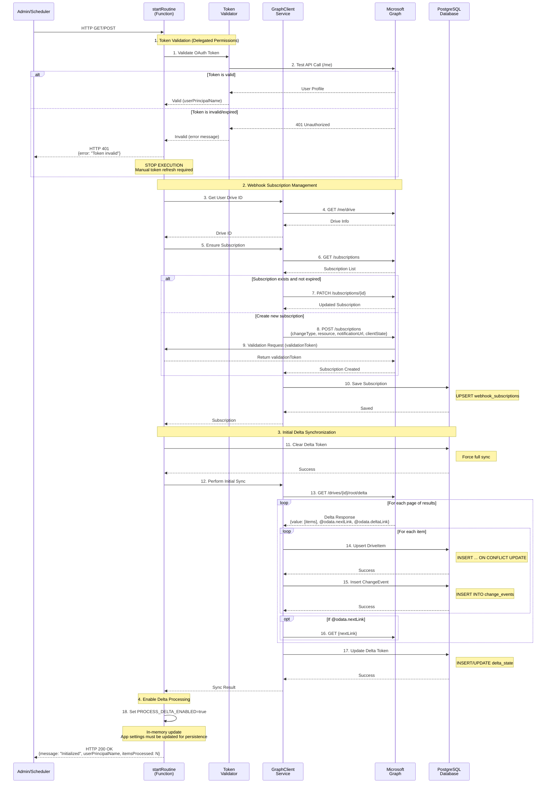
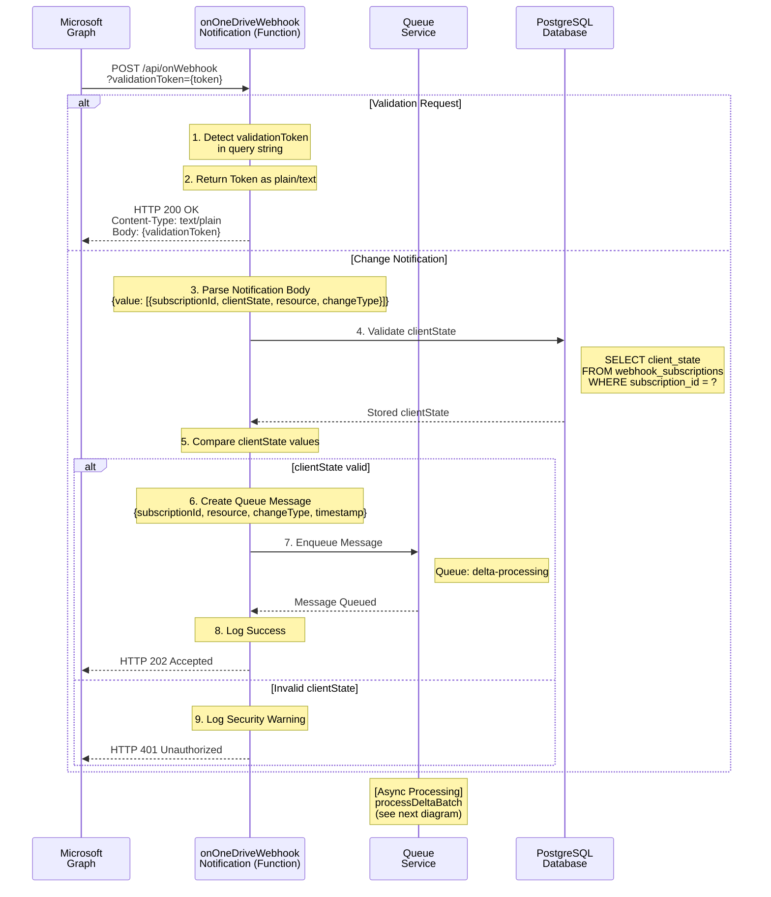
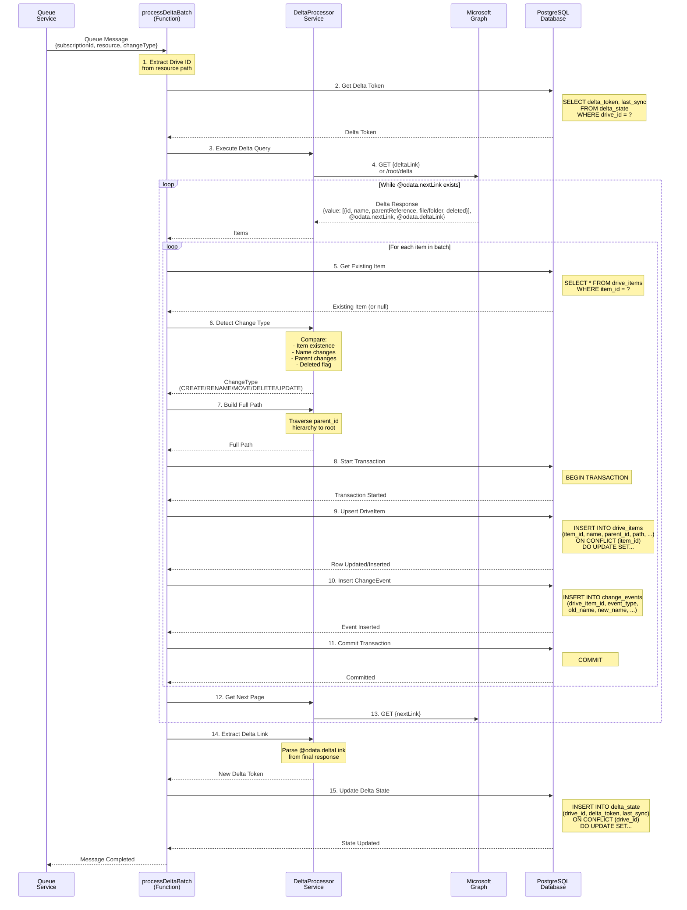
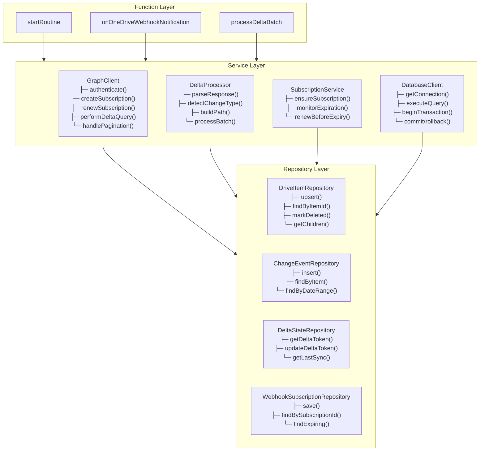
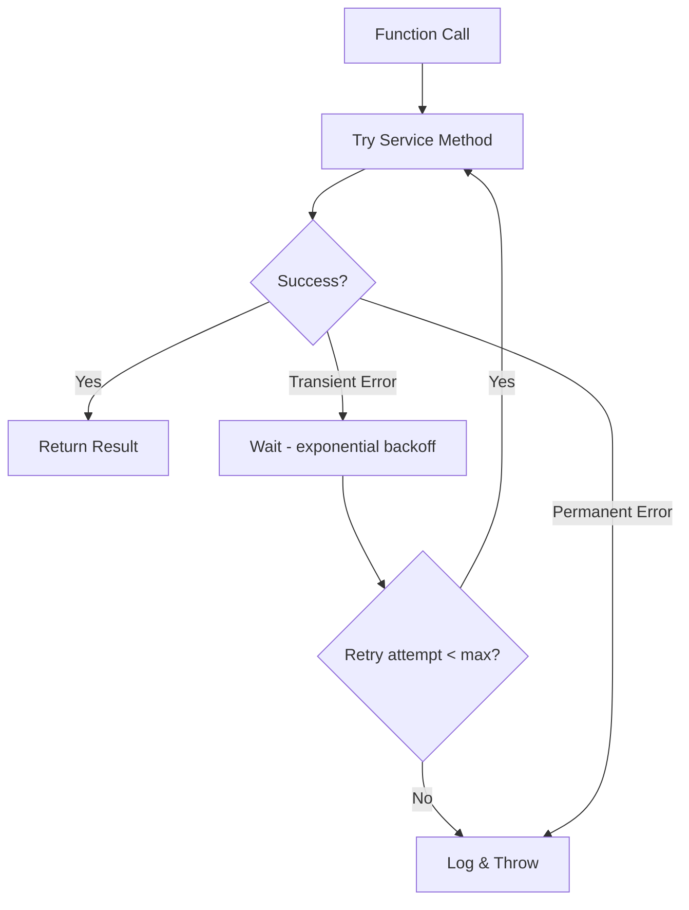
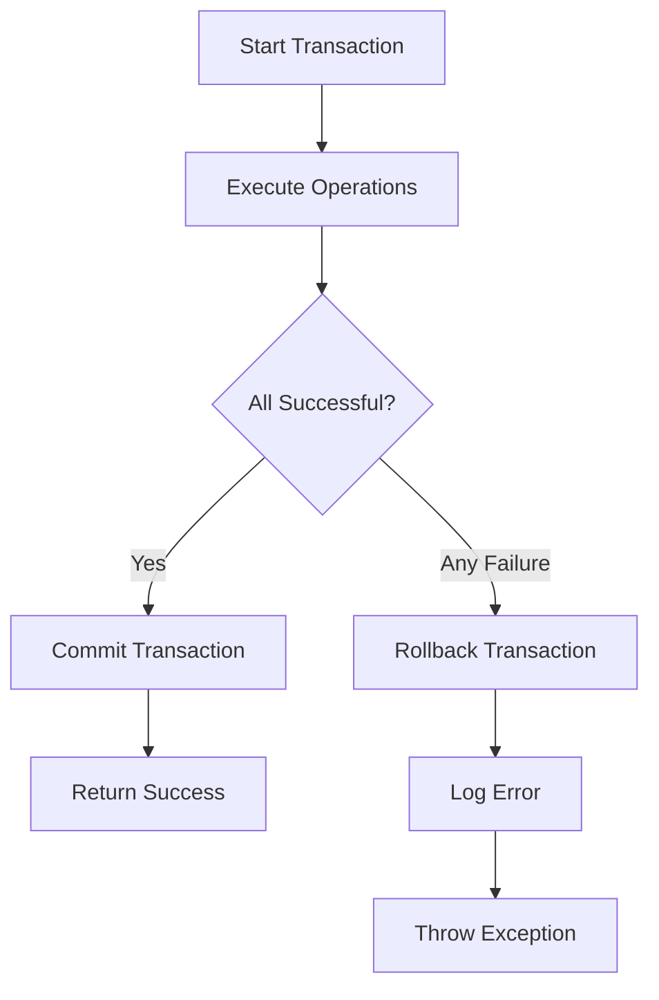
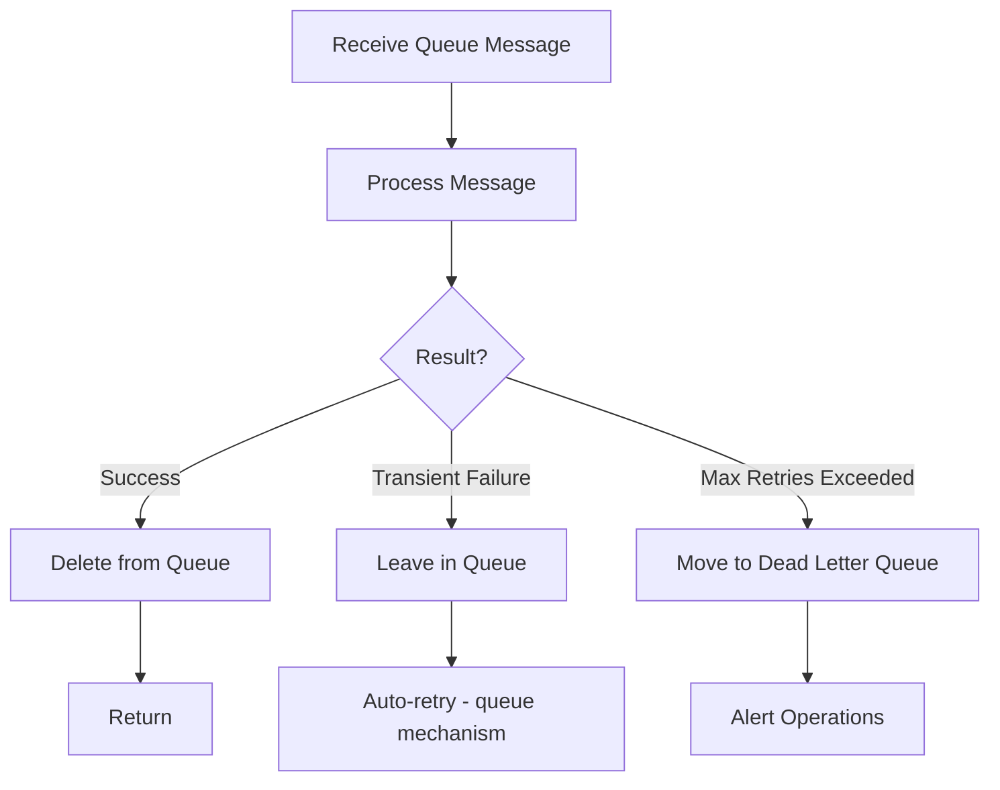

# OnedriveAudit - Function App Sequence Diagrams

**Version:** 1.0  
**Last Updated:** February 15, 2026  
**Status:** Initial Design

---

## Table of Contents

1. [Overview](#overview)
2. [startRoutine Sequence](#startroutine-sequence)
3. [onOneDriveWebhookNotification Sequence](#ononedrivewebhooknotification-sequence)
4. [processDeltaBatch Sequence](#processdeltabatch-sequence)
5. [Component Interactions](#component-interactions)
6. [Error Handling Flows](#error-handling-flows)

---

## Overview

This document provides detailed sequence diagrams for the three core Azure Functions in the OnedriveAudit system:

1. **startRoutine** - Initialization and webhook subscription setup
2. **onOneDriveWebhookNotification** - Webhook notification handler
3. **processDeltaBatch** - Delta change processing

Each diagram shows the complete flow of execution including:
- Component interactions
- Data transformations
- Database operations
- Error handling paths

### Notation

- **→** : Synchronous call
- **⇢** : Asynchronous operation
- **- ->** : Return value
- **[condition]** : Conditional flow
- **loop** : Iteration
- **alt** : Alternative path

---

## startRoutine Sequence

### Purpose

Initialize the system by setting up webhook subscription and performing initial delta synchronization.

### Trigger

- Manual invocation (HTTP GET/POST)
- Scheduled timer (maintenance)
- System startup

### Sequence Diagram



### Key Steps

1. **Token Validation (Steps 1-2) - DELEGATED PERMISSIONS**
   - Validate manually acquired OAuth access token
   - Token must have delegated permissions (Files.Read.All, Sites.Read.All)
   - If invalid: STOP execution, return 401, require manual token refresh
   - If valid: Continue with initialization

2. **Subscription Management (Steps 3-10)**
   - Get user's drive ID using delegated permissions
   - Check for existing subscription
   - Renew if exists and approaching expiration
   - Create new if none exists or expired
   - Handle webhook validation during creation
   - Save subscription metadata to database

3. **Initial Delta Sync (Steps 11-20)**
   - Retrieve existing delta token (if any)
   - Perform delta query (initial or incremental)
   - Handle pagination for large result sets
   - Process each item: upsert drive_items, insert change_events
   - Extract new delta token from response

4. **State Persistence (Step 21)**
   - Save delta token for next incremental sync
   - Update last_sync timestamp

### Response

**Success (200 OK):**
```json
{
  "status": "success",
  "message": "System initialized successfully",
  "subscriptionId": "abc-123-def",
  "subscriptionExpiration": "2026-02-22T06:00:00Z",
  "itemsProcessed": 1542,
  "deltaToken": "abc123...",
  "lastSync": "2026-02-15T06:30:00Z"
}
```

**Error (500):**
```json
{
  "status": "error",
  "message": "Failed to initialize",
  "error": "Authentication failed: Invalid client credentials"
}
```

---

## onOneDriveWebhookNotification Sequence

### Purpose

Handle webhook notifications from Microsoft Graph when OneDrive changes occur.

### Trigger

- HTTP POST from Microsoft Graph
- Contains change notification or validation request

### Sequence Diagram



### Key Steps

1. **Validation Request Handling (alt path 1)**
   - Microsoft Graph sends validation request with `validationToken` query param
   - Function extracts token and returns it as plain text
   - Required during subscription creation and periodic revalidation

2. **Notification Processing (alt path 2)**
   - Parse notification body containing subscription details
   - Extract subscriptionId, clientState, resource, changeType
   - Validate clientState matches stored value for security
   - Enqueue message for asynchronous delta processing
   - Return 202 Accepted immediately (don't block webhook)

3. **Security Validation**
   - Compare received clientState with stored value in database
   - Reject request with 401 if validation fails
   - Log security warnings for investigation

### Request Examples

**Validation Request:**
```
POST /api/onWebhook?validationToken=abc123xyz
Content-Type: application/json
```

**Change Notification:**
```
POST /api/onWebhook
Content-Type: application/json

{
  "value": [
    {
      "subscriptionId": "7f105c7d-2dc5-4530-97cd-4e7ae6534c07",
      "subscriptionExpirationDateTime": "2026-02-22T18:23:45.9356913Z",
      "clientState": "secretClientValue",
      "changeType": "updated",
      "resource": "/drives/b!-RIj2DuyvEyV1T4NlOaMHk8XkS_I8MdFlUCq1BlcjgmhRfAj3-Z8RY2VpuvV_tpd",
      "resourceData": {
        "id": "01YWDX3NM3LS4O6YHZNFBLK4Q5GGQGBR7C"
      },
      "tenantId": "84bd8158-6d4d-4958-8b9f-9d6445542f95"
    }
  ]
}
```

### Response Examples

**Validation Response (200 OK):**
```
Content-Type: text/plain

abc123xyz
```

**Accepted Response (202 Accepted):**
```json
{
  "status": "accepted",
  "message": "Notification queued for processing"
}
```

**Unauthorized Response (401 Unauthorized):**
```json
{
  "status": "error",
  "message": "Invalid client state"
}
```

### Error Handling

- **Invalid JSON:** Return 400 Bad Request
- **Missing clientState:** Return 401 Unauthorized
- **Queue unavailable:** Return 503 Service Unavailable with retry header
- **Database error:** Log error, return 202 (don't block Microsoft Graph)

---

## processDeltaBatch Sequence

### Purpose

Process delta changes from Microsoft Graph and update database with new/modified/deleted items.

### Trigger

- Queue message from onOneDriveWebhookNotification
- Manual invocation for testing

### Sequence Diagram



### Key Steps

1. **Initialization (Steps 1-2)**
   - Extract drive ID from queue message
   - Retrieve current delta token from database
   - Handle missing token (first sync scenario)

2. **Delta Query (Steps 3-4)**
   - Call Microsoft Graph delta endpoint
   - Use stored delta token for incremental sync
   - Handle pagination for large result sets

3. **Item Processing Loop (Steps 5-11)**
   - For each item in delta response:
     - Retrieve existing item from database
     - Detect change type (create/rename/move/delete)
     - Build full hierarchical path
     - Start database transaction
     - Upsert drive_items record
     - Insert change_events record
     - Commit transaction

4. **Change Detection Logic (Step 6)**
   - **CREATE:** Item doesn't exist in database
   - **RENAME:** Name changed, same parent_id
   - **MOVE:** parent_id changed, same or different name
   - **DELETE:** deleted flag set in Graph response
   - **UPDATE:** Other metadata changed

5. **Pagination (Steps 12-13)**
   - Check for @odata.nextLink in response
   - Fetch subsequent pages
   - Continue until @odata.deltaLink received

6. **State Update (Steps 14-15)**
   - Extract new delta token from @odata.deltaLink
   - Update delta_state table
   - Record last_sync timestamp

### Change Detection Examples

**CREATE:**
```typescript
// Item not in database
existingItem === null
changeType = ChangeType.CREATE
```

**RENAME:**
```typescript
// Name changed, same parent
deltaItem.name !== existingItem.name
deltaItem.parentReference.id === existingItem.parent_id
changeType = ChangeType.RENAME
```

**MOVE:**
```typescript
// Parent changed
deltaItem.parentReference.id !== existingItem.parent_id
changeType = ChangeType.MOVE
```

**DELETE:**
```typescript
// Deleted flag set
deltaItem.deleted !== undefined
changeType = ChangeType.DELETE
```

### Error Handling

**Retry Logic:**
- Transient Graph API errors: Exponential backoff, max 5 retries
- Database errors: Rollback transaction, retry message
- Persistent failures: Move to dead letter queue

**Transaction Management:**
- Each item processed in separate transaction
- Rollback on error preserves data consistency
- Delta token updated only after all items processed

**Dead Letter Queue:**
- Messages that fail after max retries
- Manual inspection and reprocessing
- Alerts sent to operations team

---

## Component Interactions

### Service Layer Dependencies



### Data Flow Between Components

1. **Function → Service:**
   - Functions call service methods
   - Pass primitive types and DTOs
   - Receive processed results

2. **Service → Repository:**
   - Services use repositories for persistence
   - Repositories return domain objects
   - Services orchestrate business logic

3. **Service → External APIs:**
   - GraphClient wraps Microsoft Graph
   - Handles authentication and retries
   - Returns typed responses

---

## Error Handling Flows

### Transient Error Retry Flow



### Transaction Rollback Flow



### Queue Message Retry Flow



---

## Performance Considerations

### Pagination Strategy

- Process delta responses in batches
- Maximum 200 items per Graph API call
- Use @odata.nextLink for continuation
- Store progress to handle interruptions

### Database Optimization

- Use connection pooling
- Batch inserts where possible
- Index frequently queried columns
- Use transactions for consistency

### Webhook Response Time

- Return 200/202 within 5 seconds
- Async processing via queue
- Microsoft Graph timeout: 30 seconds
- Avoid synchronous heavy operations

---

## Appendix

### Queue Message Schema

```typescript
interface DeltaProcessingMessage {
  subscriptionId: string;
  resource: string;
  changeType: string;
  timestamp: string;
  correlationId?: string;
}
```

### Delta Response Schema

```typescript
interface DeltaResponse {
  '@odata.context': string;
  '@odata.nextLink'?: string;
  '@odata.deltaLink'?: string;
  value: DriveItem[];
}

interface DriveItem {
  id: string;
  name: string;
  parentReference?: {
    driveId: string;
    id: string;
    path?: string;
  };
  file?: {};
  folder?: {};
  deleted?: {
    state: string;
  };
  lastModifiedDateTime: string;
}
```

### Change Event Types

```typescript
enum ChangeType {
  CREATE = 'CREATE',
  RENAME = 'RENAME',
  MOVE = 'MOVE',
  DELETE = 'DELETE',
  UPDATE = 'UPDATE'
}
```

---

**Document Maintained By:** Solution Architect Agent  
**Review Cycle:** Quarterly or on major flow changes  
**Related Documents:** 
- [architecture.md](./architecture.md) - System architecture overview
- [uml-class-data-model.md](./uml-class-data-model.md) - Data model diagrams (TBD)
